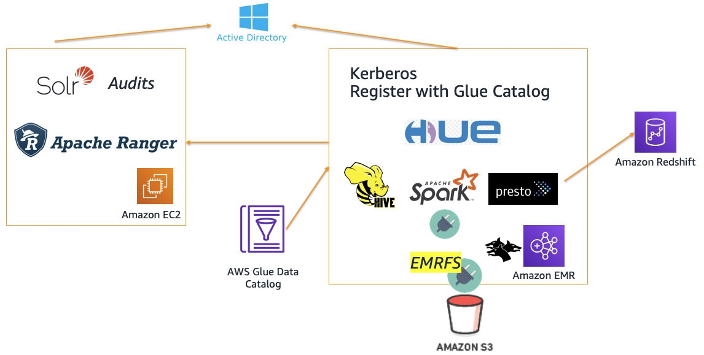
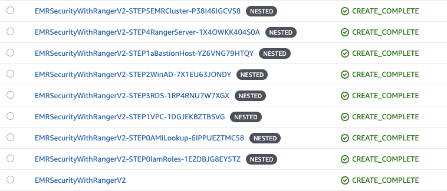
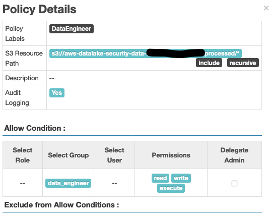

# Authorization and Auditing on Amazon EMR Using Apache Ranger - V2
The repo contains code tied to [AWS Big Data Blog](https://aws.amazon.com/blogs/big-data/implementing-authorization-and-auditing-using-apache-ranger-on-amazon-emr/) on Implementing Authorization and Auditing on Amazon EMR Using Apache Ranger
This is V2 of the blog post with following updates

- Apache Ranger 2.0
- Windows AD server on EC2
- RDS MySQL database for Apache Ranger
- Amazon EMR cluster with Kerberos
   * Ranger Plugins
     * HDFS
     * Apache Hive
     * Apache PrestoDB plugin - optional 
       * Uses hive table/column definitions when the using 'hive' catalog)
       * NOTE: It does not support column masking/row filtering yet (we are exploring it)
     * EMRFS S3 plugin (**beta**) - optional
     * SparkSQL Plugin (**beta**) - optional

> Plugins marked as **beta** has not been tested in production

| Module | Cloudformation stack | Architecture | Description |
| ---------------- | --- | --- |-------------------------------------------------------- |
| [AD setup with Kerberos](v2) |  |  | Deployment using [Microsoft AD server](https://docs.microsoft.com/en-us/windows-server/identity/ad-ds/get-started/virtual-dc/active-directory-domain-services-overview), Hive, HDFS, Spark (beta), EMRFS S3 (beta) and Presto Plugin |

## Cloudformation stack output

## Deployment steps
- Once stack is up, create AD users and groups and activate them
- Before running spark jobs, create HDFS home directory for each user
- Sample table DDL, SQL and Spark code can be found under [user queries](userqueries)

> WARNING: The EMRFS S3 plugin only works when calls are made through EMRFS. By default Hive, Spark and Presto will use EMRFS to make calls to S3. Direct access to S3 outside EMRFS (Boto/cli etc) will NOT be controlled by the Ranger policies.

### EMRFS S3 Plugin definition

### References:

 - Amazon EMR: https://aws.amazon.com/emr/
 - EMRFS: https://docs.aws.amazon.com/emr/latest/ManagementGuide/emr-fs.html
 - Amazon EMR + Kerberos: https://docs.aws.amazon.com/emr/latest/ManagementGuide/emr-kerberos.html 
 - Apache Ranger: https://ranger.apache.org/
 - Apache Ranger + Amazon EMR Blog: https://aws.amazon.com/blogs/big-data/implementing-authorization-and-auditing-using-apache-ranger-on-amazon-emr/
 - Apache Ranger Presto Plugin: https://cwiki.apache.org/confluence/display/RANGER/Presto+Plugin
 - Apache Ranger Spark Plugin: https://github.com/yaooqinn/spark-ranger
